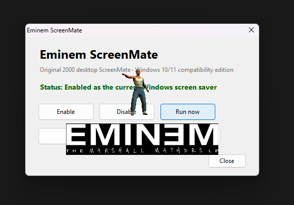

> **AI disclosure:** AI was used to write and debug the modern Windows compatibility code. The original screensaver, animations, and sounds are preserved unchanged.



# Eminem ScreenMate

The original Eminem ScreenMate from 2000, running on modern Windows.

He walks onto your desktop, says his lines, shows the album cover, then starts shooting, spitting, pissing, and generally wrecking the place.
Same old screensaver.

The original program still draws the animations and plays the sounds through [WineVDM](https://github.com/otya128/winevdm).
All original files stay intact.

## Where it came from

I've been hunting this down on and off for the last 11 years. Originally, it was uploaded to both Interscope and Eminem's websites, but all of those archive links come up dry once you try to actually download the file. I had almost given up hope on ever seeing it again, but tonight I was in the mood to hunt again and actually found it. 

The original `eminem.zip` was found through the Wayback Machine, in [an archived download from eminemfans.com](https://web.archive.org/web/20070307034311/http://www.eminemfans.com/main/extras/download/eminem.zip).
That archive is included here.

Alongside the original `eminem.zip`, this repo contains a modern version of the screensaver that will work on Windows 10/11, and supports multiple monitors of varying resolutions and orientations.

## Run it

Install [Eminem ScreenMate Setup.exe](Eminem%20ScreenMate%20Setup.exe), then choose **Eminem ScreenMate** in Windows Screen Saver Settings.
The Start Menu app has a **Run now** button too. It supports playing the screensaver whether it is currently enabled or disabled, and also offers a shortcut to the Windows screensaver settings.

Built for 64-bit Windows 10 and 11; tested on Windows 11.

## Multiple monitors

Your screens are detected automatically.
Each gets its own desktop screenshot, so portrait displays keep their proper shape.

The intro plays on the main screen, then destruction happens randomly across all connected screens at the original overall pace.
Sound comes from one instance.
That includes effects from the other monitors, with the background song playing only once.

## What's here

- **Eminem.zip**: the unchanged original archive.
- **Modern Version Source/**: compatibility code, dependencies, and [build instructions](Modern%20Version%20Source/BUILD_README.txt).
- **Eminem ScreenMate Setup.exe**: the current installer, version 1.3.0.
- **SHA256SUMS.txt**: file hashes for checking the package.

The current build passed a two-minute visible test across three monitors, including a portrait screen, with no crashes or audio errors.

## Building

You'll need the Visual Studio C++ tools and the .NET Framework compiler.
From `Modern Version Source`, run:

```powershell
powershell -NoProfile -ExecutionPolicy Bypass -File wrapper\build.ps1
```

Compatibility details are in [WINDOWS_10_11_NOTES.txt](Modern%20Version%20Source/WINDOWS_10_11_NOTES.txt).
The monitor adapters also use [MinHook](https://github.com/TsudaKageyu/minhook); its source and license are included.
